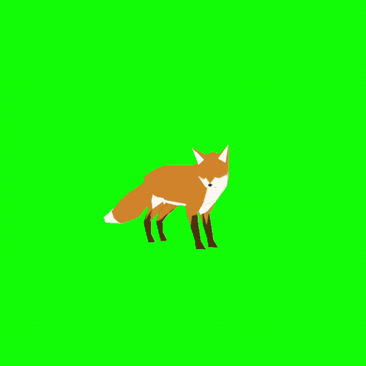

# 3D Viewer (OBJ, GLTF2.0 and MMD)

This software is 3D Viewer for OBJ, GLTF and MMD(PMX/VMD), written in JOGL.
The code written here is no longer maintained but it will help you learn how 3DCG works as an implementation of Inverse Kinematics (IK), Virtual Texture Fetch (VTF) or something.

## Usage
You can install this software from "Release" tab on this page.
Execute the JAR files, then you can pick a 3D Model you want to see.  

|Format|Support|Note|
|:-:|:-:|:-:|
|OBJ|✅||
|GLTF|✅|GLTF2.0 models are mostly supported|
|PMX/VMD|Experimental||

I've tested most of GLTF samples but several examples may not be rendered as intended. (I marked those features as TODO in the source code.)

## Walkthrough
### OBJ
* Rotate: Hold Mouse Button

### GLTF
* Zoom In/Out: `WSED` Keys
* Move: Arrow Keys

### PMX/VMD
* Zoom In/Out: `WSED` Keys
* Move: Arrow Keys

###### For Motion
* Play: `P` Key
* Reverse: `O` Key
* Stop: `I` Key
* Reset: `3` Key
* Prev/Skip: `1/2` Key

## How can I get a model of these formats?
### GLTF
You can grab GLTF models from 
[this repository](https://github.com/KhronosGroup/glTF-Sample-Models). 

### PMX/VMD
PMX/VMD is 3D format used in MMD(Miku Miku Dance). VMD includes motion data which is applied to PMX model. I recommend you to visit MMD community website since they have produced numerous characters or motions. 

## Are there any specifications of those formats?
Here are links you may want to read:
* [GLTF 2.0 Specification](https://registry.khronos.org/glTF/specs/2.0/glTF-2.0.pdf)
* [Wavefront OBJ](https://en.wikipedia.org/wiki/Wavefront_.obj_file)
  
NOTE: The specifications of PMX/VMD is unofficial. 

## Trouble Shooting
Some anti-virus softwares prevent this software from executing. If you have that situation, please go to settings then exclude the temporary directory on which `jogamp_***.exe` is running.
It's also important that you have to assign high priority to `java.exe`.
